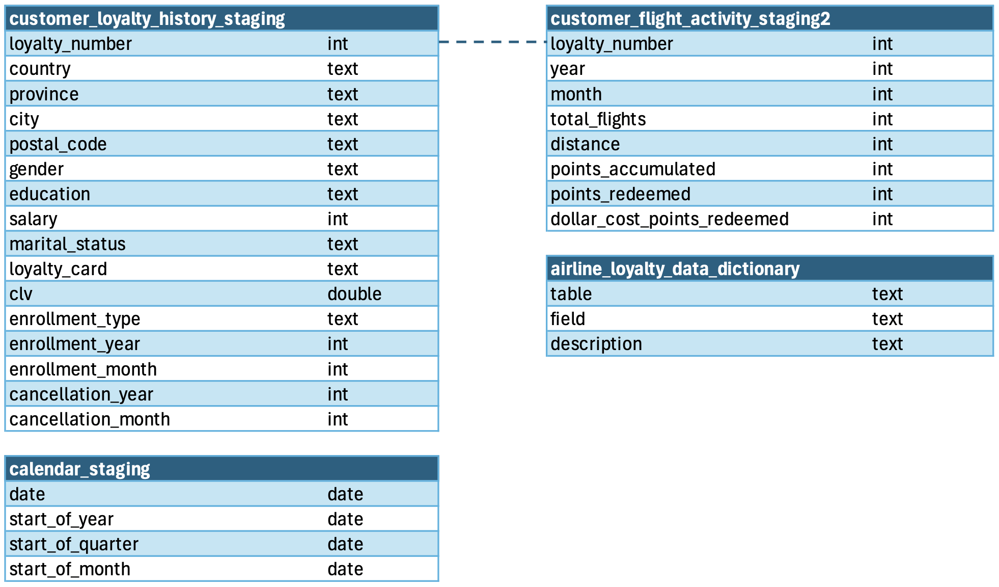
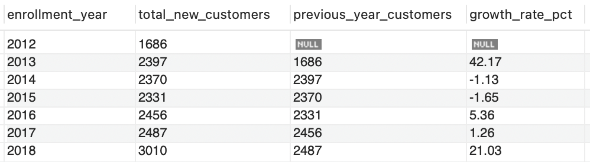
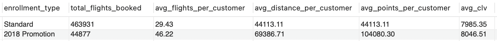
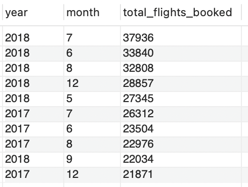
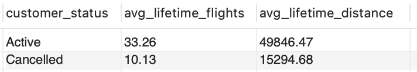

# Airline Loyalty Program Analysis

# Project Background
Northern Lights Air (NLA) is a fictitious airline based in Canada. NLA runs a customer loyalty program that 16,737 customers signed up for. In an effort to improve program enrollment, NLA ran a promotion between February - April 2018. The dataset spans 2012 - 2018 and covers approximately 409,000 records across four related tables: customer loyalty history, monthly flight activity, a date dimension table, and a data dictionary. 

Insights and recommendations are provided on the following key areas:

- **Loyalty Program Enrollment Trends:** An evaluation of the historic signup patterns, focusing on growth trends and Customer Lifetime Value (CLV)
- **2018 Promotion Analysis:** An analysis of the 2018 Promotion customers, understanding their travel profile and impact on revenue
- **Flight Activity & Travel Trends:** An analysis of flight booking patterns, seasonal trends, and the profile of the program's most active customers
- **Cancellation & Churn Analysis:** An assessment of cancelled customer profiles with the goal of predicting future cancellations

The SQL queries used to inspect and clean the data can be found [here](airline_loyalty_data_clean.sql).

Targeted SQL queries regarding various business questions can be found [here](airline_loyalty_EDA.sql).

# Data Structure & Initial Checks

The company's main database structure consists of four tables, with a total row count of 408,383 records:

- `customer_loyalty_history_staging` - 16,737 rows
- `customer_flight_activity_staging2` - 389,065 rows  
- `calendar_staging` - 2,557 rows
- `airline_loyalty_data_dictionary` - 24 rows

A description of each table is as follows:

Prior to beginning the analysis, a variety of checks were conducted for quality control and familiarisation with the dataset. The SQL queries utilised to inspect and perform quality checks can be found [here](airline_loyalty_data_clean.sql).

# Executive Summary

### Overview of Findings

Since the loyalty program launched in 2012, enrollment grew significantly in 2013 (+42%) before stabilising, then jumped again in 2018 (+21%) driven by the 2018 Promotion. The promotion attracted high-value customers who booked 57% more flights and accumulated 136% more points per customer than Standard enrollees, and generated 2.75 times more Customer Lifetime Value (CLV) per year of membership in their first year. Total distance travelled grew 28% year-over-year from 2017 to 2018, with June–August consistently driving peak booking activity. The overall cancellation rate stands at 12.35%, with no meaningful variation by province, salary, or loyalty tier.

# Insights Deep Dive
### Loyalty Program Enrollment Trends

* Since the loyalty program launched in 2012, enrollment grew from 1,686 in 2012 to 2,397 customers in 2013 which corresponds to the 42% growth and presents the most significant year on year growth in the history of the program. 
  
* Enrollment growth was negative in 2014 and 2015 with -1.13% and -1.65% respectively, then it went up to 5.36% in 2016, before falling to 1.26% in 2017.
  
* In 2018, the enrollment grew again to 21.03%, with 3,010 new customers signing up, 971 of whom were part of the 2018 Promotion.

* The 2018 Promotion accounts for 5.8% of the total customer base (971 of 16,737), suggesting targeted promotions can meaningfully accelerate growth even from a relatively small cohort.

### 2018 Promotion Analysis
* The 2018 Promotion ran from February to April 2018, with signups growing month to month:  295 in February, 330 in March, and 346 in April. Out of the 971 who signed up, only 4.84% did not travel at all.
  
* Those who signed up through the 2018 Promotion, have booked on average 46.22 flights vs 29.43 flights for Standard enrollment type customers, which shows a 57% higher average per customer.
  
* The 2018 Promotion group have accumulated on average 136% more points than the Standard group, 104,080 and 44,113 points respectively. 
  
* Whilst average CLV for 2018 Promotion and Standard customers is very similar ($8,046.51 and $7,985.35 respectively), the average CLV per year of membership shows that 2018 Promotion customers generated 2.75 times more CLV in their first year ($8,046.51) than the Standard customers ($2,931.72). Long-term value remains to be confirmed.

### Flight Activity & Travel Trends 

* Total distance travelled grew 28% year-over-year from 2017 to 2018, with June–August consistently driving peak booking activity.
  
* 7 out of the 10 top customers by total flights booked enrolled in 2018 through the 2018 Promotion. 9 out of the 10 top customers by total flights booked are from the British Columbia, Ontario and Quebec where 78% of customers reside.
  
* Amongst the top 10 customers by total flights booked, 60% hold the Nova (mid-tier) loyalty card with only one Aurora cardholder — suggesting the program's most active flyers are not necessarily its highest-tier members. CLV within this group varies significantly, ranging from $2,746 to $13,990.
  
* Despite representing only 5.8% of the customer base, 2018 Promotion enrollees account for 20% of the top 10 customers by CLV, further supporting the promotion's effectiveness in attracting high-value customers.

### Cancellation & Churn Analysis: 

* On average, customers remain part of the loyalty program for just under 3 years, with the cancelled customers averaging just over 1 year and active customers averaging just over 3 years.
  
* The overall cancellation rate stands at 12.35%, with no meaningful variation by province, salary, loyalty tier, or enrollment channel. The 2018 Promotion cancellation rate (11.84%) is virtually identical to the Standard rate (11.66%).
  
* Cancelled customers averaged only 10 lifetime flights compared to 33 for active customers, a 3x difference, suggesting early engagement level is the most reliable retention signal.
  
* Cancellation rates across enrollment years (2013–2017) remain broadly stable at 15–17%, suggesting retention has not meaningfully worsened over time. The 2018 members show a lower rate (5.28%) but this reflects limited exposure time rather than improved retention — most 2018 members had less than a year of membership before the dataset ends.

# Recommendations:

Based on the insights and findings above, the following recommendations have been provided: 

* **Review the 2018 Promotion members data at the end of 2019** to see if their CLV has remained as high as in 2018 and they have not cancelled their membership. If the result is positive, the promotion can be considered a success in the long term and it would be worth running it again to attract more high-value customers. 

* In order to predict churn, **continuously analyse flight activity to identify members with low overall flight activity and re-engage with them** via flight promotions or other offers to increase their flight activity. 
  
* Since the top 10 flyers are predominantly Nova (mid-tier) cardholders, not Aurora, we recommend to **hold a tier review to investigate whether the tier structure is correctly rewarding the most active customers**, or whether high-frequency flyers are being under-recognised.
  

# Assumptions and Caveats:

Throughout the analysis, multiple assumptions were made to manage challenges with the data. These assumptions and caveats are noted below:

* The dataset is synthetically generated and therefore might not reflect real world customer behavior in airline loyalty programs.  

* The `airline_loyalty_data_dictionary` defines `total_flights` as Sum of Flights Booked (all tickets purchased in the period) - which does not mean 'taken/travelled' since the data does not specifically point to it. 
  
* The loyalty card tiers are not specified, but given the numbers of holders, it appears the Star is the lowest level (45.63% of database), followed by the Nova (33.88%), with Aurora(20.49%) being the top tier. 
  
* There were no records of cancellations for 2012 and we would treat this as missing data instead of assuming that none of those who signed up in 2012 had since cancelled their membership.

* 25% of values in the Salary column were missing. Deletion of all rows with NULL salary values would have reduced the dataset by 25% and introduced selection bias, so NULL values were retained and salary-based analysis was performed on the 75% of customers with salary data.

* The 2018 Promotion members have not been members long enough for us to confidently establish their long term value or cancellation trends, further analysis is required as more time passes. 

